# Thermoelectric Ice-Cream Chest (Thermal & CFD Analysis)
---
**Tools:** ANSYS Fluent 2024 R1 | CAD Modelling | Computational Fluid Dynamics | 

**Type:** Self-Directed Learning Project (2024)

## Project Overview & Design Intent
Street ice-cream vendors often operate without reliable access to grid electricity, relying on heavy, passive cold packs or direct power setups that limit mobility. The purpose of this study investigated the thermal behaviour, velocity distribution, and cold-air recirculation patterns inside a thermoelectric (Peltier-based) refrigeration system (i.e. portable ice-cream chest) designed for off-grid operations. It utilizes an integrated battery and dynamo system driven by the cart system; which acts as a generator producing energy rather than direct power connections which is lacked in the ice-cream carts. The project evaluated how Peltier placement impacts cooling uniformity, boundary layer behaviour, and Coefficient of Performance (COP).

Beyond the physical application, this project served as my primary gateway into practical Computational Fluid Dynamics (CFD). I used it as an early, hands-on opportunity to learn geometry preparation, mesh consideration, boundary condition setup, and post-processing visualization within ANSYS Fluent.

## Engineering Considerations
To maximize cooling performance before running simulations, the physical structure was designed with Key thermal strategies in mind:
* **Material Selection:** Polyurethane was selected as the outer shell material for its thermal resistance and low thermal conductivity.
* **Geometric Optimization:** Standard rectangular chests often suffer from stagnant "heat pockets" in sharp 90° internal corners. The cavity was modelled with rounded, filleted internal corners to encourage smooth motion along the perimeter boundary layers.
* **Evaluation Objectives:** Assess internal air velocity, evaluate convective transport patterns, compare the effectiveness of two distinct Peltier module arrangements.

---

## Configuration Analysis

### 1. Two-Peltier Setup (Long Wall Array)
* **Setup:** Two thermoelectric modules placed side-by-side along one of the long side walls.
* **Velocity Dynamics:** Airflow velocity peaked at ~95.1 m/s near the active boundary faces. The adjacent placement created two distinct, symmetrical circulation loops sweeping downward and across the floor of the compartment.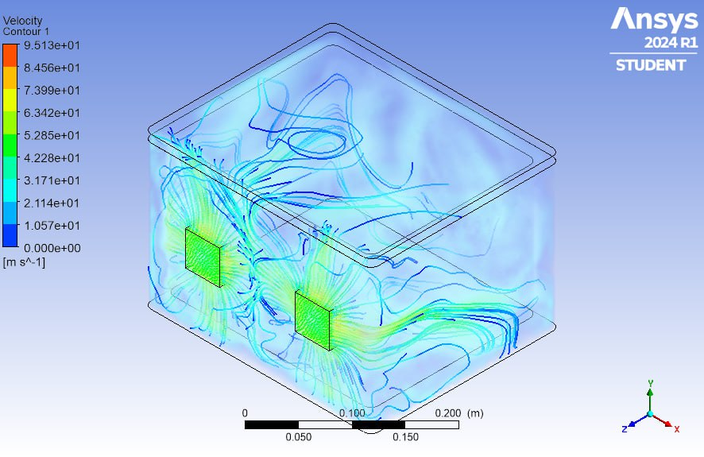
* **Thermal Behaviour:** Maintained a remarkably uniform temperature field (~271 K to 273 K) across the primary compartment volume.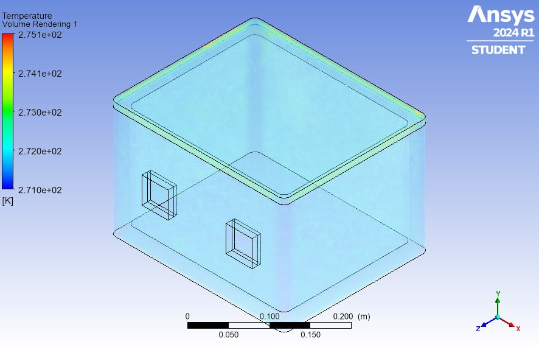
* **Key Finding:** While thermal distribution was even, omitting active cooling on the opposing short wall left the far end dependent on secondary boundary currents, making it ideal for low-power steady-state holding rather than fast pull-down.

### 2. Three-Peltier Setup (Multi-Wall Array)
* **Setup:** Two modules positioned along the long wall and one added to the adjacent short wall.
* **Velocity Dynamics:** Produced higher localized forced convection velocity (~194.7 m/s peak localized scale) and introduced a complex, asymmetrical multi-directional flow loop.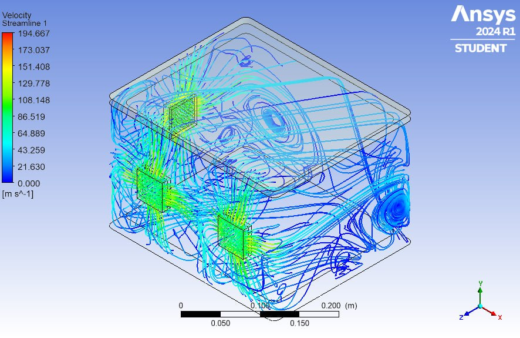
* **Thermal Behaviour:** Generated deeper localized cooling drops (~270.9 K / -2.2°C) and rapidly dispersed cold air throughout the main volume.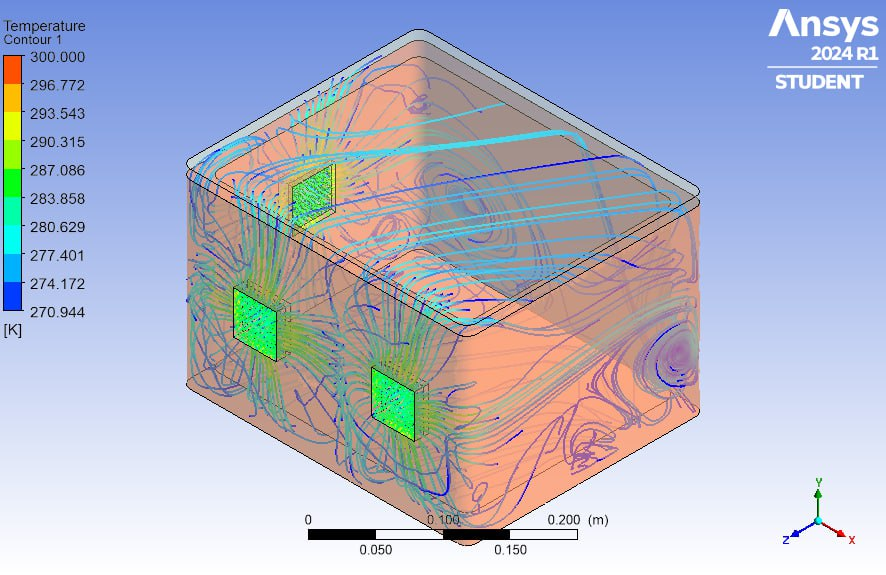
* **Key Finding:** The asymmetrical layout dramatically increased mixing and reduced transient cooling times, providing superior pull-down performance when surplus power is available from the dynamo.

---

## Key Learning Outcomes
* **Boundary Layer Flow:** Confirmed through streamline post-processing that internal corner fillets successfully eliminated flow stagnation, allowing cold air currents to hug the insulation walls smoothly.
* **CFD Workflow Mastery:** Gained practical, self-taught experience in defining thermal-fluid boundary conditions, analysing convergence, and interpreting velocity contours and 3D streamline plots in ANSYS Fluent.
* **Trade-off Evaluation:** Demonstrated how numeric simulation guides real-world engineering decisions—balancing thermal pull-down performance against system power consumption in off-grid mobile applications.

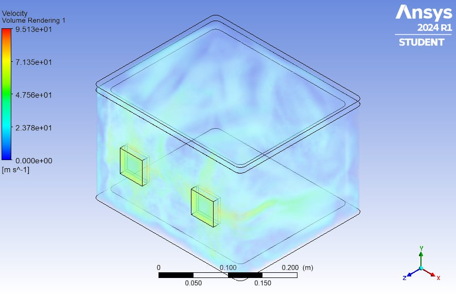, 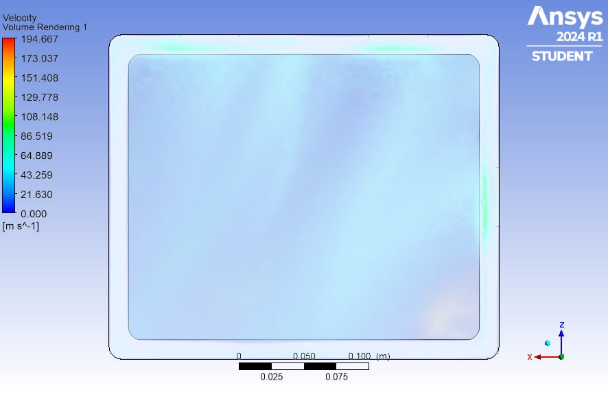, 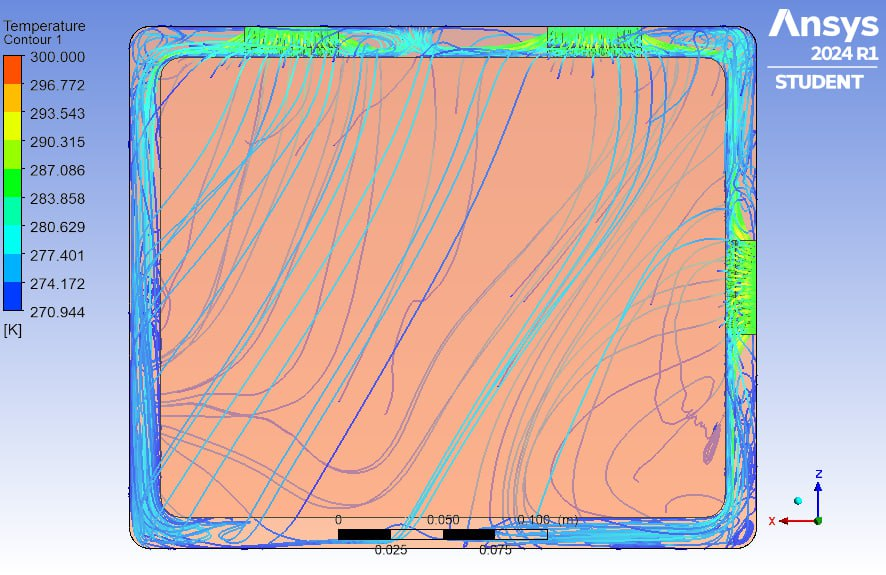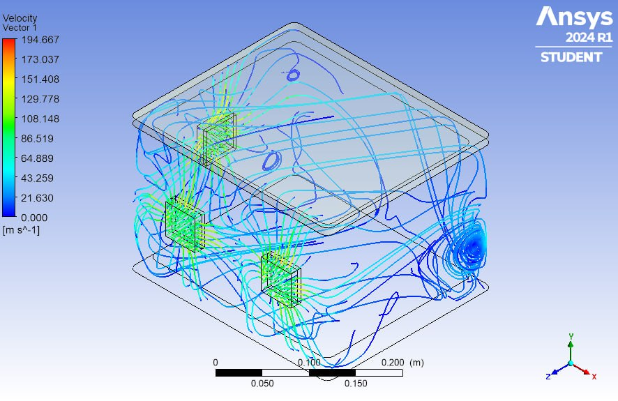, 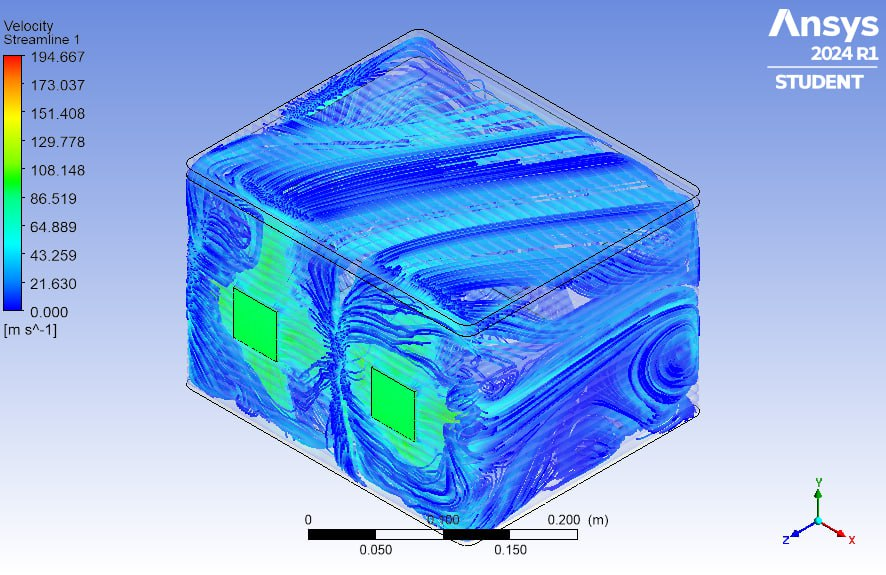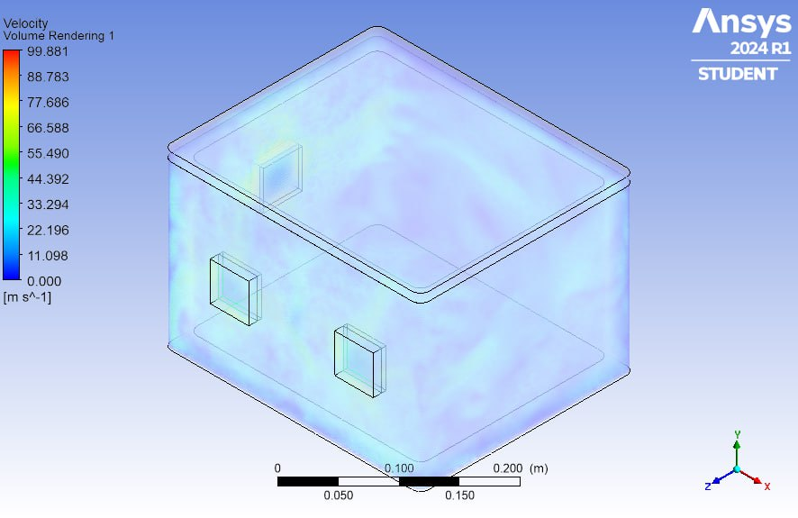, 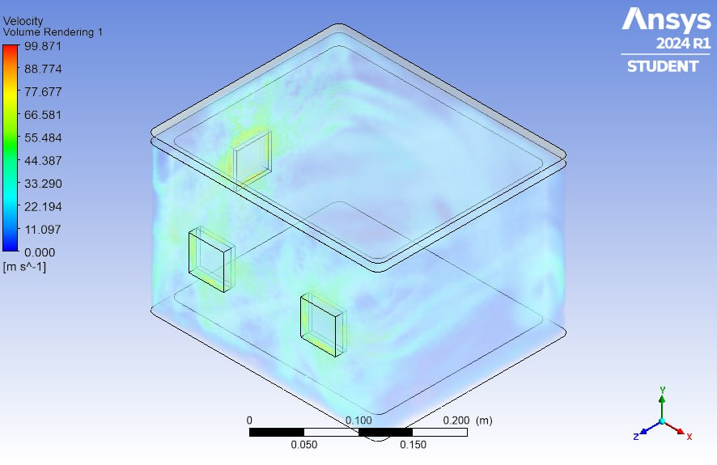
